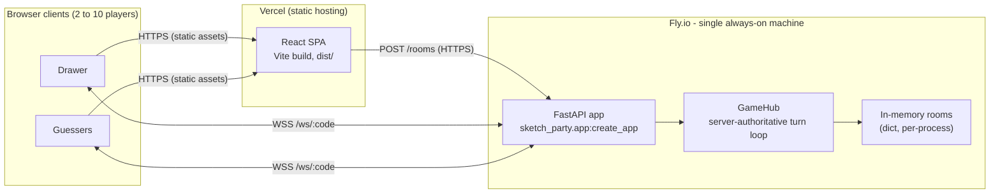

# Sketch Party

Real-time, mobile-first drawing-and-guessing party game for 2 to 10 players: join a room by
a 4-letter code, one player draws a secret word while everyone else guesses in a live chat,
and points scale with how fast a correct guess lands.

[Live demo](https://example.com) (placeholder - link goes live once the backend and frontend
are deployed; see "Deployment" below) &middot;
[](https://github.com/Siddhesh-Bhande/sketch-party/actions/workflows/ci.yml)

## What this project demonstrates

This is a portfolio piece, not a production game studio's product. It exists to show:

- A real-time system built on raw WebSockets, not a managed realtime SDK: a
  server-authoritative game loop, a hand-rolled reconnect protocol, and a typed message
  contract shared between a Python backend and a TypeScript frontend.
- React performance work on a genuinely hot path: freehand drawing input arriving many
  times a second, resampled and normalized before it ever reaches the network.
- Accessibility treated as a real constraint on an inherently visual surface, including an
  honest account of where it cannot fully apply.
- A test pyramid that actually gets exercised in CI: unit tests on both sides of the wire
  plus a two-browser end-to-end test that plays a real turn.

## Architecture



The frontend is a static single-page app: Vercel serves the built `dist/` and rewrites every
path to `index.html` (the app reads a `?room=CODE` query param client-side for deep links).
It talks to the backend two ways: an HTTPS `POST /rooms` to create a room, then a WebSocket
to `/ws/{code}` for everything that happens during a game. The backend is a single FastAPI
process; `GameHub` is the only layer allowed to mutate room state, always under a per-room
lock, and it is the sole source of truth for the secret word, the turn timer, and scores.
Rooms live in a plain Python dict in that process's memory - there is no database and no
Redis, which is exactly what makes the "single always-on machine" constraint below load-bearing.

## Decisions and tradeoffs

**Server-authoritative timer and scoring.** The client never sends elapsed time, a score, or
a "guess is correct" verdict - it sends guesses and intents (`guess`, `chooseWord`,
`startGame`, ...) and the server decides everything else. `GameHub` runs one asyncio task per
active room that ticks once a second off a `Room.turn.start_time` plus an injected clock
(not a loop counter), so a delayed tick still reports the right `secondsLeft`, and a
disconnected/reconnecting client can't manipulate its own timer or score.

**A custom typed WebSocket protocol instead of Socket.IO or a managed realtime service
(Ably, Pusher, Supabase Realtime).** Every message on the wire is a Pydantic model on the
backend (`sketch_party.protocol`) and a matching TypeScript type on the frontend, joined by a
discriminated `type` field and a shared camelCase-on-the-wire / snake_case-in-Python
convention. That is more code than dropping in a managed pub/sub channel would have been,
but it is also the point of the exercise: this project is meant to demonstrate building the
transport and reconnect handling directly on WebSockets, with the compiler checking both ends
of every message shape, rather than delegating that boundary to a library.

**In-memory rooms, single instance, Redis pub/sub as future work.** Keeping rooms in a
process-local dict made the state machine simple to write and simple to test (no
serialization, no network round-trip inside a single request). The direct cost is that this
service cannot be scaled horizontally: two machines would each hold a different, incomplete
view of who is in which room, and a player's socket could land on either one. `api/fly.toml`
pins the deploy to exactly one always-on machine to make that constraint structural rather
than a note someone has to remember. Scaling beyond one process would mean moving room state
out of the process - most naturally into Redis, with room mutations published over pub/sub
and each machine subscribing to the rooms whose sockets it holds. That is deliberately out of
scope here.

**Normalized stroke coordinates.** Every point a client draws is sent as `(x, y)` in the
`0..1` range relative to the canvas, not raw pixels. Drawer and guessers can have different
canvas sizes (different screens, different window widths) and still see the same picture in
the same place, and it means the server never needs to know a canvas's pixel dimensions to
relay a stroke.

**Idempotent per-id stroke sync.** Each stroke carries a client-generated `id`. The hub keeps
a per-room ordered buffer keyed by that id, so a stroke update (the polyline growing as the
drawer keeps moving the pen) replaces the existing entry rather than appending a duplicate,
and a client that reconnects mid-turn can be handed the full current buffer as one
`canvasReplace` message and land in a consistent state instead of replaying every intermediate
frame.

## Real-time flow

1. A client `POST /rooms` to get a 4-letter room code, then opens `wss://.../ws/{code}` and
   sends `{"type": "join", "name": ...}` as the first frame.
2. The server tracks connection state per player (connected/disconnected, not removed) so a
   dropped socket - a phone lock screen, a flaky network - can reattach mid-game instead of
   losing its seat; `useGameSocket` on the frontend retries with backoff and shows a
   "reconnecting" state rather than bouncing the player out.
3. During a turn, the drawer's `stroke`/`undo`/`clearCanvas` messages go to the hub, which
   updates the per-room stroke buffer and rebroadcasts to every other connected player in that
   room; guesses go through server-side matching (exact match vs. a "near miss" hint) and, on
   a correct guess, a scoring function that rewards faster guesses more.
4. The hub's own timer task ends the turn when `turn_seconds` elapses, computes final scores
   for that turn, and advances to the next drawer or, after the configured number of rounds,
   to game over.

## Testing

- **124 backend tests** (`api/tests`, pytest + pytest-asyncio): room state machine, the
  matching and scoring functions, the wire protocol's (de)serialization, the connection
  manager, reconnect handling, the timer task, and full WebSocket integration tests against
  the FastAPI app.
- **169 frontend tests** (`web/src`, Vitest + Testing Library): the store, the protocol
  layer, each screen (Home, Lobby, Game, Game Over), and the smaller UI components (timer
  bar, scoreboard, guess input, drawing toolbar, connection overlay) in isolation.
- **A Playwright two-client end-to-end test** (`web/e2e/play-turn.spec.ts`): drives two real
  browser contexts through creating a room, joining, starting a game, drawing a stroke, and
  guessing correctly - the one test that exercises the full stack instead of a mocked half of it.
- All three run in CI (`.github/workflows/ci.yml`: `backend`, `frontend`, `frontend-e2e`
  jobs), plus a `docker` job that builds the backend's production image on every push and
  pull request so a broken Dockerfile fails CI instead of surfacing at deploy time.

## Accessibility

Home and Lobby are scanned with `@axe-core/playwright` in CI
(`web/e2e/a11y.spec.ts`) and fail the build on any serious or critical violation. Interactive
elements use visible `focus-visible` rings, not just browser defaults; connection state,
the event feed, and guess feedback are announced through `aria-live="polite"` regions instead
of only being conveyed visually.

The honest limit: the drawing canvas itself is not screen-reader usable. A freehand drawing
surface communicates through shape and motion, and there is no accessible equivalent to
"watch someone draw" that this project attempts to fake. That is inherent to the medium, not
a gap in this implementation - the accessibility work here is scoped to the surrounding UI
(joining, reading state, guessing), where it is honestly achievable.

## Run it locally

One command, no local Python or Node toolchain required:

```bash
docker compose up --build
```

This builds the backend image from `api/Dockerfile` and serves it on
`http://localhost:8000` (`ALLOWED_ORIGINS=http://localhost:5173`), and runs the frontend dev
server in a Node container on `http://localhost:5173`
(`VITE_API_URL=http://localhost:8000`, `VITE_WS_URL=ws://localhost:8000`). Open two browser
tabs at `http://localhost:5173` to play against yourself.

Without Docker:

```bash
# backend
cd api && uv sync && uv run uvicorn sketch_party.app:create_app --factory --reload

# frontend, in a second terminal
cd web && npm ci && npm run dev
```

See `.env.example` (root, plus `api/.env.example` and `web/.env.example`) for every variable
either side reads.

## Deployment

The intended split is Vercel for the static frontend and a single Fly.io machine for the
WebSocket backend; there is no live deploy checked into this repo, only deploy-ready config
that CI validates on every push:

- **Backend**: `api/Dockerfile` builds a `python:3.12-slim` image with `uv`, installing only
  production dependencies, and runs `uvicorn sketch_party.app:create_app --factory` bound to
  `0.0.0.0:${PORT:-8000}`. `api/fly.toml` deploys it as app `sketch-party` with
  `min_machines_running = 1` and `auto_stop_machines = false` - it must stay a single
  always-on machine, because scaling out or letting Fly suspend-and-restart the sole machine
  on idle would silently drop every in-memory room (see "Decisions and tradeoffs" above).
  `fly deploy` from `api/` after `fly launch`/`fly apps create sketch-party`.
- **Frontend**: `npm run build` in `web/` produces `dist/` (a Vite SPA, about 78 KB of JS and
  12 KB of CSS gzipped per the last local build); `web/vercel.json` adds the SPA rewrite plus
  security headers. Set the project's `VITE_API_URL`/`VITE_WS_URL` build-time env vars in
  Vercel to the deployed backend's HTTPS/WSS origin before building.
- **CORS**: once the frontend has a real URL, set the backend's `ALLOWED_ORIGINS` (a Fly
  secret or edited into `api/fly.toml`'s `[env]` block) to that exact origin - the WebSocket
  handshake rejects any other `Origin` header.
- **Keep-warm**: `.github/workflows/keep-warm.yml` curls the backend's `/healthz` every ~10
  minutes so a free-tier instance doesn't cold-start on the next visitor. Set the
  `BACKEND_HEALTH_URL` repository secret to the deployed health check URL; the job skips
  itself gracefully if that secret is unset.

### What's left to actually go live

Everything above is deploy-ready config, not a deployed app. To go from this repo to a
working demo, you still need to:

1. Run `fly apps create sketch-party` (or adjust the `app`/`primary_region` in
   `api/fly.toml` to whatever name/region you actually create) and `fly deploy` from `api/`.
2. Create a Vercel project pointed at `web/`, and set its `VITE_API_URL`/`VITE_WS_URL`
   environment variables to the Fly app's real HTTPS/WSS origin.
3. Set the backend's `ALLOWED_ORIGINS` to that Vercel origin (and, if embedding the demo in
   an iframe on a portfolio site, replace the placeholder
   `https://YOUR-PORTFOLIO-DOMAIN.example` in `web/vercel.json`'s `frame-ancestors` directive
   with the real portfolio domain).
4. Add the `BACKEND_HEALTH_URL` repository secret (`https://<your-fly-app>.fly.dev/healthz`)
   so the keep-warm workflow has something to ping.
5. Swap the "Live demo" link at the top of this README from its placeholder to the real
   Vercel URL.

## Status

All phases complete: FastAPI backend with a typed protocol, room/connection managers, game
hub, server-authoritative turn timer, and reconnect handling; a Vite + React 19 + TypeScript
+ Tailwind frontend covering the full game loop plus a lone-visitor demo path; and this
deployment configuration. See `docs/superpowers/plans/` for the phase-by-phase build plan and
`docs/superpowers/specs/` for the original design spec.
